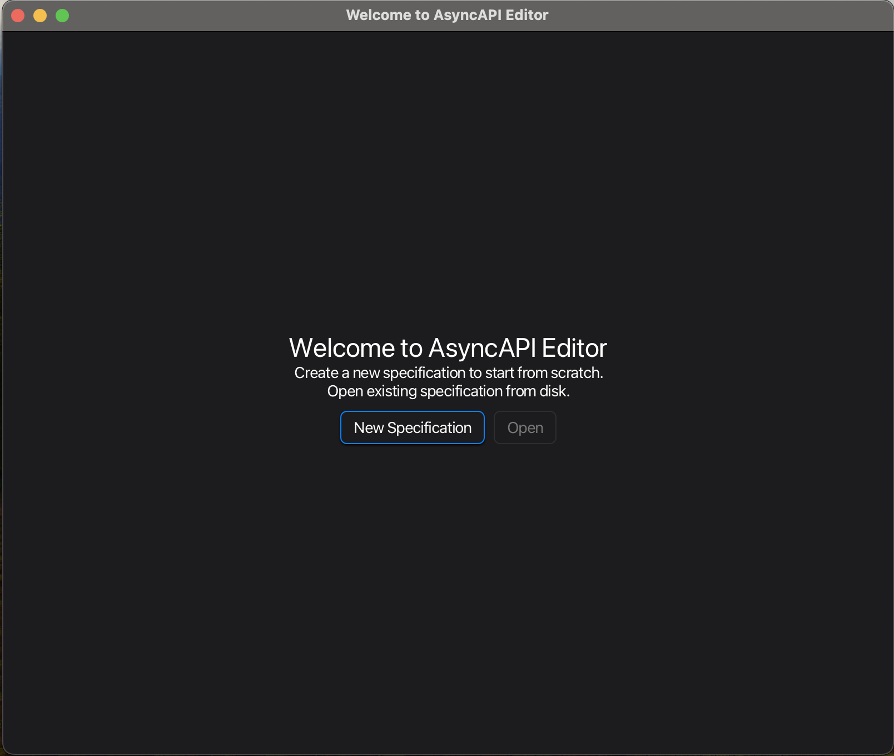
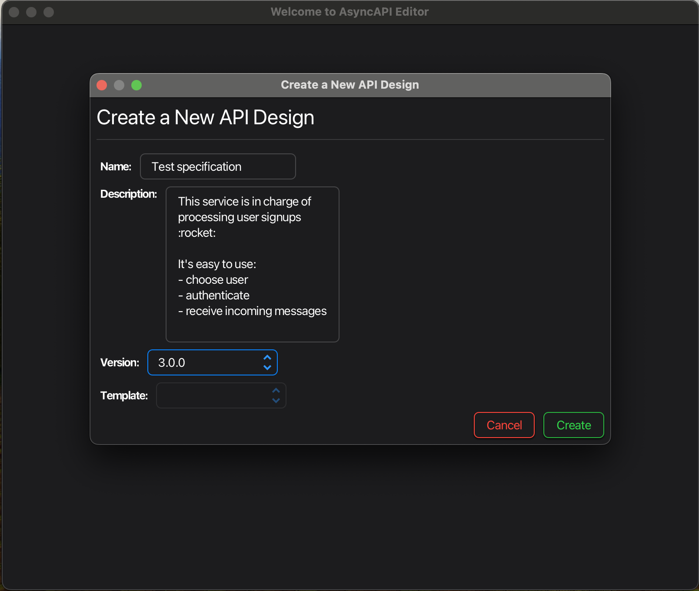
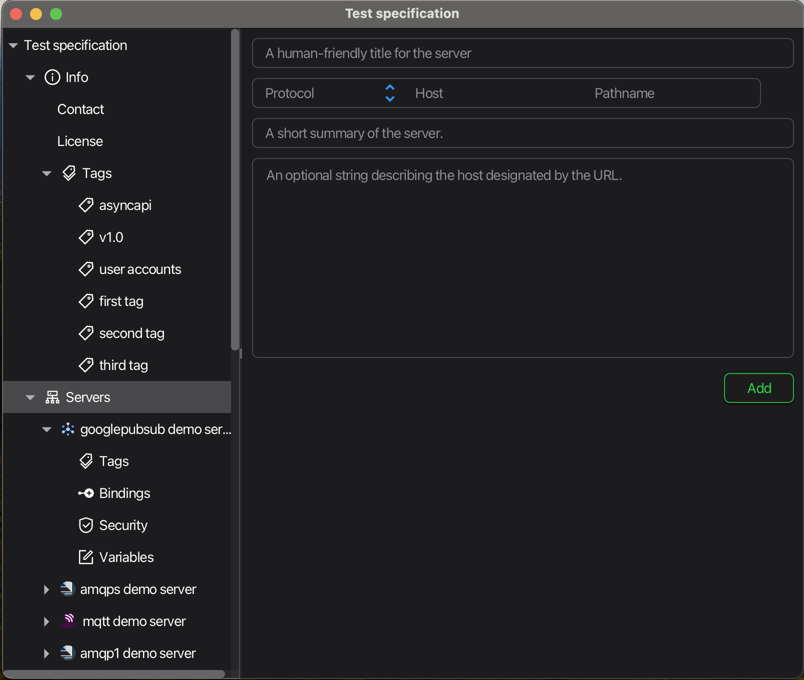
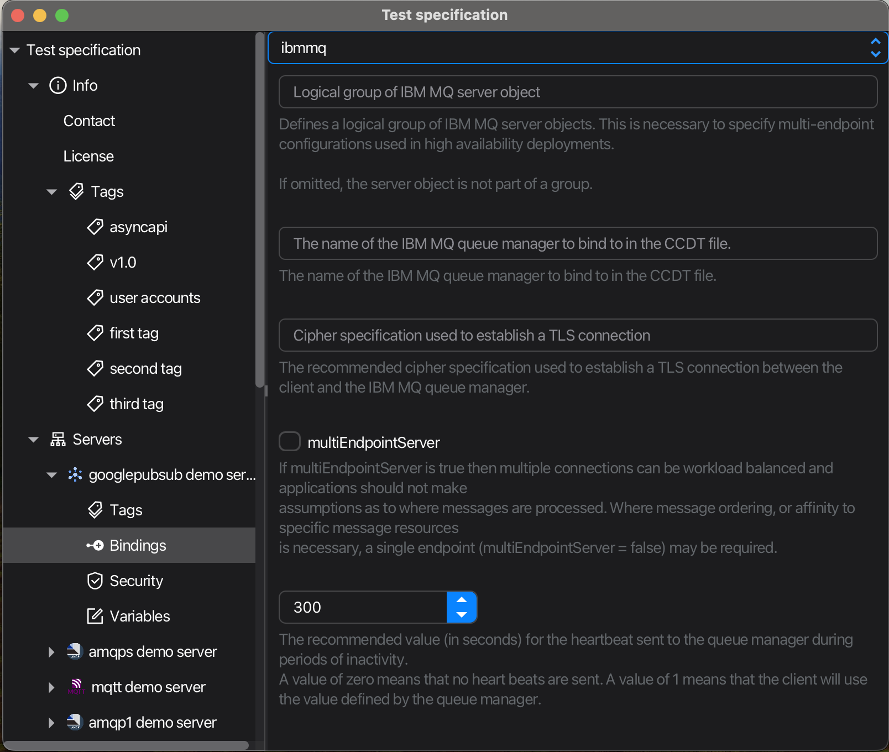

# Asyncapi editor

## Preview

<p float="middle">
  
  
  
  
</p>

## Launch locally

Prerequisites:

- [SDKMAN!](https://sdkman.io) to install required java


Prepare your environment
```shell
sdk env install
```

Read [instruction](https://github.com/asyncapi/jasyncapi#publish-new-release)(pgp section) and install `asyncapi-core:1.0.0-EAP-3-SNAPSHOT` locally
```shell
git clone -b feat/java-module https://github.com/asyncapi/jasyncapi.git

sdk env install

mvn clean install -D=skipTests=true
```

Launch app
```shell
./gradlew :run
```